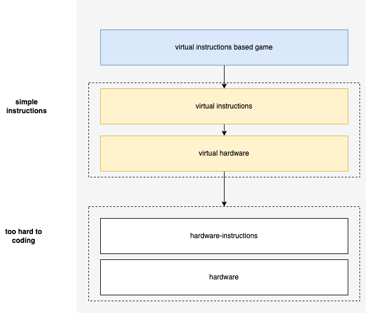
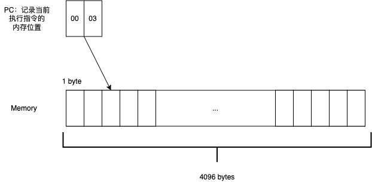
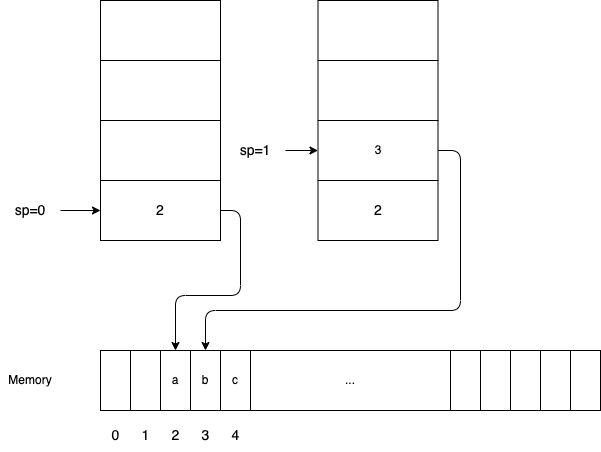
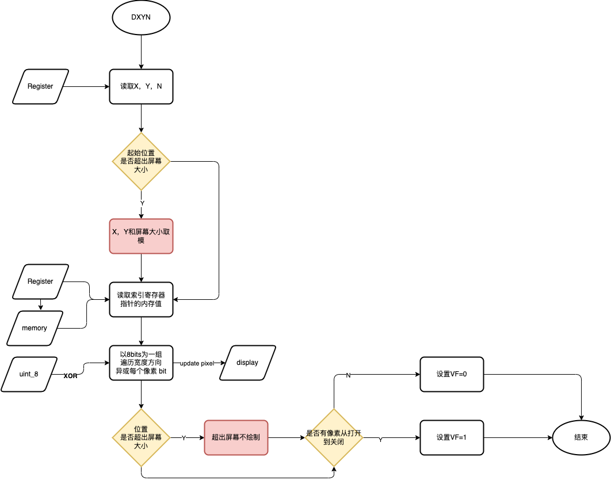

# CHIP-8


> CHIP-8 is an interpreted programming language, developed by Joseph Weisbecker made on his 1802 Microprocessor. It was initially used on the COSMAC VIP and Telmac 1800 8-bit microcomputers in the mid-1970s. CHIP-8 programs are run on a CHIP-8 virtual machine. It was made to allow video games to be more easily programmed for these computers.
>

CHIP-8 是一种解释型语言，设计之初就是为了编写简单的小游戏。我猜是作者嫌老机器的汇编语言太复杂繁琐，从而自己设计了一门汇编语言，并且摆脱硬件的束缚，在模拟器上运行。其实这个思想和 Java 等基于虚拟机的高级语言也是类似的，提供方便程序员编写的指令集，在硬件之上空架一层虚拟机，实现 "Write Once, Run Everywhere"。



## 使用

```shell
make
./emulator <frequency> <rom name>
```

## [CHIP-8 虚拟机的组成](https://en.wikipedia.org/wiki/CHIP-8?useskin=vector#Virtual_machine_description)

- Memory：CHIP-8 最多有 4096 字节的内存

> CHIP-8 解释器本身占用这些机器上的前 512 字节内存空间。因此，为原始系统编写的大多数程序都从内存位置 512 (0x200) 开始，并且不会访问位置 512 (0x200) 以下的任何内存。最上面的 256 个字节 (0xF00-0xFFF) 保留用于显示刷新，下面的 96 个字节 (0xEA0-0xEFF) 保留用于调用堆栈、内部使用和其他变量。

- Program Counter：16 位的 PC，记录当前程序指令运行的内存位置，因为需要访问最多 4K 的内存（0xFFF）

- Stack：16 位地址的堆栈，用于调用函数和返回。栈调用深度最初设计位 12 层，可以自行调整。

- Registers：
  - 16 个 8 位数据寄存器（data register），名为 V0 至 VF。 VF 寄存器兼作某些指令的标志；因此，应该避免这种情况。在加法运算中，VF 是进位标志，而在减法运算中，VF 是“无借位”标志。在绘制指令中，VF 在像素冲突时设置。
  - 一个 16 位索引寄存器（index register），用于记录内存地址

- Timers
  - 8 位延迟定时器，以 60 Hz（每秒 60 次）的速率递减，直至达到 0
  - 8 位声音定时器，当其值非零时，会发出蜂鸣声。

- Display：64 x 32 像素（或 128 x 64 对于 SUPER-CHIP）单色，即黑或白

- Inputs：16 个输入键，与前 16 个十六进制值匹配：0 到 F。

- Opcode：CHIP-8 有 35 个操作码（指令），都是两个字节长并以大端存储。完整的列表可以参考 WiKi 上的。下面给出操作码的规范，将指令分为了 4 个半字节（4 bits）：
  - NNN: 第二、第三和第四半字节。表示 12 位内存地址。
  - NN: 第二个字节（第三个和第四个半字节）。8 位立即数
  - N: 第四个半字节。4 位立即数
  - X 和 Y：4 位寄存器标识符，指令的第二个和第三个半字节。用于查找从 V0 到 VF 的 16 个寄存器之一

### 内存

如上所述，CHIP-8 有 4096 字节的内存，并且内存的最小分配单位是一字节，因此只需要 12 位（`0xFFF`）便可以寻址整个内存空间。

由于 C 语言中没有 12 位的类型，所以使用 `uint16_t` 也就是 ` unsigned short` 来表示内存地址：



```c
struct chip8 {
  uint8_t mem[4096];
  uint16_t index_reg;
  uint16_t pc;      // keep trace of opcode address
};
```

### 函数调用栈的实现

CHIP-8 是支持函数调用的，因此也需要考虑函数调用栈的实现，栈的特性就是先进后出，先调用的函数后执行。比如下面的程序会输出：`cba`。

```c

int main() {
  a();
}

void a() {
  b();
  printf("a");
}

void b() {
  c();
  printf("b");
}

void c() {
  printf("c");
}
```

要实现栈的特性，可以简单使用数组来实现，我们需要记住最后一个函数入栈的下标 `i`。

- 入栈：新函数的内存地址从 `i+1` 位置讲函数内存地址写入数组
- 出栈：新函数调用结束（return），递减栈的下标 `i = i-1`



函数调用对应指令为：`2NNN`，函数返回的指令为：`00EE`。

```C
  uint16_t stack[16];
  uint8_t sp;  // keep trace of stack top

/**
 * Return from a subroutine
 */
void opcode_00EE(CHIP8 *chip8) {
  byte pc = chip8->stack[chip8->sp--];
  chip8->pc = pc;
}

/**
 * Call subroutine at NNN
 */
void opcode_2NNN(CHIP8 *chip8) {
  chip8->stack[chip8->sp++] = chip8->pc;
  chip8->pc = NNN(_OPCODE);
}

```

### 定时器

CHIP-8 有两个独立的定时器寄存器：延迟定时器和声音定时器。大小为 1 个字节，只要它们的值大于 0，它们就应该每秒减少 60 次（即 60 Hz ），并且与执行指令的速度无关。也就是说无论代码怎么执行，即使进入了死循环，定时器也需要以 60 Hz 的频率运行。

- 延时计时器作用是，使用 CHIP-8 游戏将检查计时器的值并根据需要自行等待

- 声音计时器则是只要它高于 0，就会让计算机发出“蜂鸣声”

```C
  uint8_t delay_timer;
  uint8_t sound_timer;

  long last_timer_time = current_micros();
  while (1) {
    long now = current_micros();
    if (now - last_timer_time >= TIMER_DELAY) {
        if (chip8->delay_timer > 0) {
          chip8->delay_timer--;
          }
    if (chip8->sound_timer > 0) {
      chip8->sound_timer--;
      }
    }
  }
```

### 显示屏

CHIP-8 的显示屏宽 64 像素，高 32 像素。每个像素都可以打开或关闭（黑色或者白色）。换句话说，每个像素都是一个布尔值，或者说是一个 bit。

最初的 CHIP-8 解释器以 60 Hz 的频率更新显示（即它们的帧率为 60 FPS）。并且仅在模拟器执行修改显示数据的指令时才更新屏幕，以便运行得更快。现代计算器运行速度更快，因此这个优化可做可不做。

### 字体

CHIP-8 模拟器有一组内置的字体，就是 0 到 F 的十六进制数字，需要加载到内存中。例如，字符 F 表示为 0xF0、0x80、0xF0、0x80、0x80。看一下二进制表示：

```C
11110000
10000000
11110000
10000000
10000000
```

可以看到 “F” 吗？绘制屏幕的原理就是这样：用一个 bit 表示像素的打开或者关闭，然后以一个字节为一组来绘制。

更新显示屏前，需要将索引寄存器 I 设置为字符的内存位置，然后开始绘制。因此将字体数据放在内存的前 512 字节中的任何位置 ( 000 – 1FF ) 都可以。内置的字体都以 5 个字节来表示，一共 16 个字体，需要 80 个字节，一般规定将字体放在 050 – 09F。

```C
uint8_t chip8_fontset[80] = {
    0xF0, 0x90, 0x90, 0x90, 0xF0,  // 0
    0x20, 0x60, 0x20, 0x20, 0x70,  // 1
    0xF0, 0x10, 0xF0, 0x80, 0xF0,  // 2
    0xF0, 0x10, 0xF0, 0x10, 0xF0,  // 3
    0x90, 0x90, 0xF0, 0x10, 0x10,  // 4
    0xF0, 0x80, 0xF0, 0x10, 0xF0,  // 5
    0xF0, 0x80, 0xF0, 0x90, 0xF0,  // 6
    0xF0, 0x10, 0x20, 0x40, 0x40,  // 7
    0xF0, 0x90, 0xF0, 0x90, 0xF0,  // 8
    0xF0, 0x90, 0xF0, 0x10, 0xF0,  // 9
    0xF0, 0x90, 0xF0, 0x90, 0x90,  // A
    0xE0, 0x90, 0xE0, 0x90, 0xE0,  // B
    0xF0, 0x80, 0x80, 0x80, 0xF0,  // C
    0xE0, 0x90, 0x90, 0x90, 0xE0,  // D
    0xF0, 0x80, 0xF0, 0x80, 0xF0,  // E
    0xF0, 0x80, 0xF0, 0x80, 0x80   // F
};
```

对应的绘制指令为 DXYN，绘制流程如下，需要考虑绘制屏幕边缘的场景：



### 键盘

CHIP-8 最早的计算机使用十六进制键盘。它们有 16 个键，标记为 0 到 F ，并排列在 4x4 网格中。

```
1	2	3	C
4	5	6	D
7	8	9	E
A	0	B	F
```

在现代计算器中一般使用 QWERTY 键盘（目前只考虑这种排列的键盘），为了方便游戏，我们需要做键位映射：

```
1	2	3	4
Q	W	E	R
A	S	D	F
Z	X	C	V
```

## 虚拟机运行实现

chip-8 使用两个字节的十六进制编码来编写程序，两个字节对应 cpu 指令集中的一个指令，虚拟机需要将其翻译成现代系统的操作。

0. 设计 chip-8 的结构体，需要包含符合规定的内存、调用栈、寄存器、定时器、显示器和键盘输入；
1. 加载程序文件到内存数组中，程序可访问的内存从 `0x200` 开始；
2. 虚拟机的任务就是以对应的频率（不同的游戏以不同的频率运行效果比较好）无限循环运行，执行下面三个步骤：
   - Fetch：从当前 PC 的内存中取出 CPU 指令，并将 PC 指针 +2 指向下一个指令；
   - Decode：解码指令，根据指令规范计算 X，Y，N，NN，NN 的值，便于执行使用；
   - Excute：执行指令运算。
3. 实现键盘输入（使用 SDL2，一个用 C 语言实现视频、音频、输入设备（如键盘、鼠标）等操作的库，主要用于游戏开发）；
4. 实现屏幕显示（使用 SDL2）。

### 指令说明

根据不同的指令实现同步的操作，最直观的方式就是使用 `if` 语句 或者 `switch` 语句判断，唯一的缺点是会导致代码比较长，可读性不好。后面可以考虑用函数表实现。

可以优先实现下面几个指令，然后运行 `IBM Logo.ch8` 这个程序用于测试，只这个程序是会显示 IBM 的标志，并且只使用下面的指令。包括最重要的显示指令 `DXYN`：

```
00E0 (clear screen)
1NNN (jump)
6XNN (set register VX)
7XNN (add value to register VX)
ANNN (set index register I)
DXYN (display/draw)
```

`IBM Logo.ch8` 成功绘制的结果如下，然后程序进入无限循环：


接下来就是实现 CHIP8 所有 35 个指令：

| 指令 | 类型 | 描述 |
|------|------|------|
| `0NNN` | 调用 | 执行地址 NNN 的子程序 |
| `00E0` | 显示 | 清空屏幕 |
| `00EE` | 流程控制 | 从子程序中返回 |
| `1NNN` | 流程控制 | 跳转到地址 NNN |
| `2NNN` | 流程控制 | 从 NNN 跳转到子程序 |
| `3XNN` | 条件 | 如果 VX == NN，则跳过下一条指令 |
| `4XNN` | 条件 | 如果 VX != NN，则跳过下一条指令 |
| `5XY0` | 条件 | 如果 VX == VY，则跳过下一条指令 |
| `6XNN` | 常量 | VX = NN |
| `7XNN` | 常量 | VX += NN |
| `8XY0` | 赋值 | VX = VY |
| `8XY1` | 位运算 | VX = VX \| VY |
| `8XY2` | 位运算 | VX = VX & VY |
| `8XY3` | 位运算 | VX = VX ^ VY |
| `8XY4` | 数学 | VX += VY，有进位时 VF = 1 |
| `8XY5` | 数学 | VX -= VY，有借位时 VF = 0 |
| `8XY6` | 位运算 | VX >> 1 |
| `8XY7` | 位运算 | VX = VY - VX |
| `8XYE` | 位运算 | VX << 1 |
| `9XY0` | 条件 | 如果 VX != VY，则跳过下一条指令 |
| `ANNN` | 内存地址 | 寄存器 I = NNN |
| `BNNN` | 流程控制 | PC = V0 + NNN |
| `CXNN` | 随机 | VX = rand() & NN，生成一个随机数并与 NN 按位与运算 |
| `DXYN` | 显示 | 在 (VX, VY) 位置绘制一个图像，其宽为 8bit，高为 N+1bit |
| `EX9E` | 按键操作 | 等待按键，如果 key() == VX，跳过下一条指令 |
| `EXA1` | 按键操作 | 等待按键，如果 key() != VX，跳过下一条指令 |
| `FX07` | 计时器 | 将 VX 设置为延迟计时器 |
| `FX15` | 计时器 | 将延迟计时器设置为 VX |
| `FX18` | 声音 | 将声音计时器设置为 VX |
| `FX0A` | 按键 | 等待按键，然后 VX = get_key() |
| `FX1E` | 内存地址 | I += VX (VF 不受影响) |
| `FX29` | 内存地址 | 将 I 设置为 VX 的字符地址，字符 0-F 由 4X5 字体表示 |
| `FX33` | BCD | 将 VX 中值的 BCD 码存入 I 中的地址内，百位在 I，十位在 I+1，个位在 I+2 |
| `FX55` | 内存地址 | 将 V0 到 VX 的值存入 I 中地址为起始的内存空间 |
| `FX65` | 内存地址 | 将 I 中地址为起始的内容依次存入 V0-VX |
